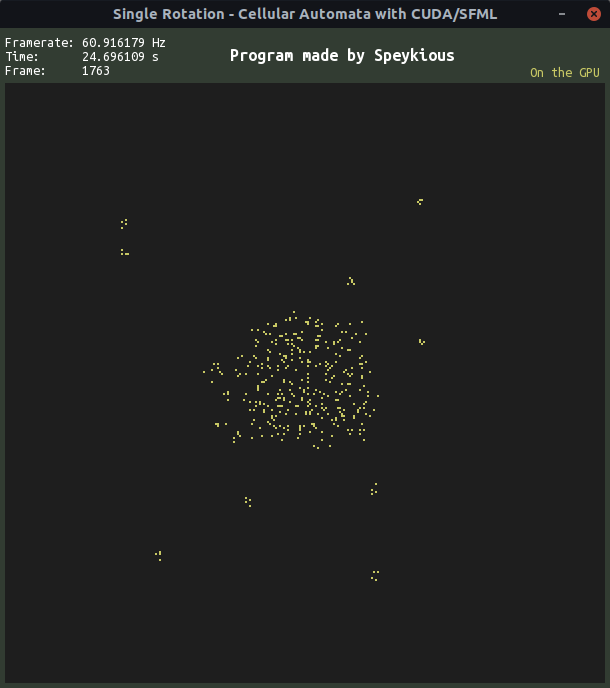

# Single Rotation with CUDA/SFML - on the GPU

Program that lets you observe the evolution of a grid state in a cellular automaton called **Single Rotation**.

Written using *CUDA/SFML* and runs on the *GPU*.

Unfortunately I haven't implemented the feature that lets you pause the simulation and run it backwards unlike the CPU-only version of this program.

# Keys
* `Escape` : Closes the program

# Side notes
The executable itself is `single_rotation.exe`. Just open a terminal in the `bin` file, write `./single_rotation.exe` and it should run.

However, I cannot guarantee that it will work for your device. And it is very likely that if you don't have a *CUDA-compatible* graphics device, it won't work for you. I coded it on my **Linux Ubuntu 18.04** operating system with an **NVIDIA GeForce GTX 950M**.

As for the CPU code, it needs the fonts `ubuntumono-r.ttf` and `ubuntumono-b.ttf` to be in the `bin` file to display the texts properly.